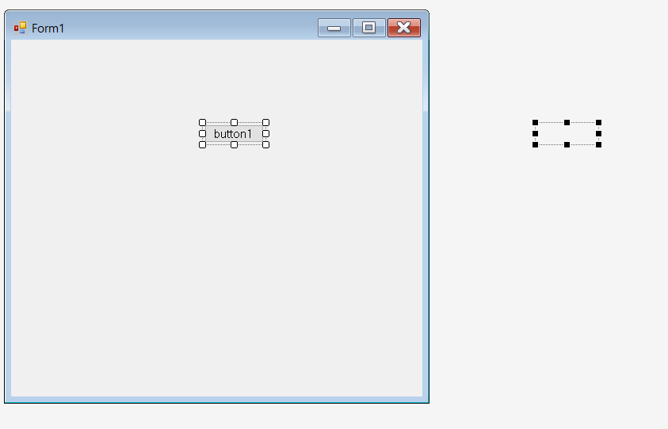
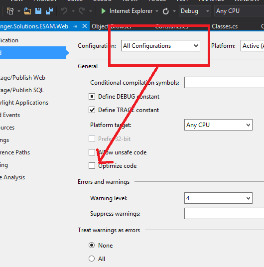

# 0. My x-company

1편 게시 후 소녀팬들의 열렬한 환호를 한 몸에 받고 ~~서둘러~~ 2편을 제작하게 되었다. 종강하고 1주일 가량 지나고 2편을 쓰려고 노트북을 켰다. 시험기간에 아주 조금 작성해 놓은 것을 잊고 다시 쓸 뻔 했다. 1편 말미에 예고했던 주제 외에 하고 싶은 아무말을 하려고 했는데 아쉽게 됐다. 

막 퇴사한 직후에는 이야기 주머니가 가득했고, 다음편 예고에서 그 내용을 함축한 제목들을 잔뜩 적어놨는데 한 학기가 흐르며 더 빡치는 과제에 의해 회사 이야기는 내 메모리에서 쫓겨났다. 다시 떠올리려고 페이지 폴트를 냈으나 디스크에 배드 섹터가 생긴 것인지 도통 기억이 나질 않는다. 이런 상황을 예방하고 데이터의 온전한 보존을 위해서는 주기적으로 자기 테이프에 덤프해야 한다. 무슨말이냐 하면, 바로 기록해두지 않으면 이렇게 횡설수설하게 된다는 이야기이다.

뜬금없지만 백준 알고리즘 문제와 내가 회사에서 겪은 문제를 비유를 통해 얘기해보고 싶다. 

* 백준문제: 철수는 심부름을 가서 물건을 사오려고 한다. 셈에 약한 철수는 지난 번 거스름돈을 잘못 받아와서 형아에게 차액을 물어줘야 했다. 철수가 거스름돈을 정확하게 받을 수 있도록 **거스름돈을 계산해주자.**

철수가 거스름돈을 잘못 받아온 건지 형아가 나쁜건지 모르겠지만, 무엇을 해야 문제를 해결할 수 있는지가 지문에서 거의 유추할 수 있다.  

* 실전문제: 아침까지만해도 열심히 코딩하고 있던 철수는 오후가 되자 갑자기 두 명이 되더니 한 명이 창문으로 뛰어내렸다.  문제가 있어보이지만 철수의 분열을 지켜보지 못한 다른 사람은 문제를 알아차리지 못했다. 무슨 문제인지 알아보기 위해 영희가 철수에게 말을 걸었지만 갑자기 돌변하여 철수를 창문으로 던져버렸다. 

뭔가 혼란스럽다. 사실 알고리즘 외적인 부분 (환경설정이라던가 시맨틱 에러~~시맨틱 에러 검색했다가 bl 소설만 나와서 당황함... 이처럼 매번 당황스러운 상황이 발생할 수 있다.~~라던가...) 발생하는 문제가 꽤 많다.


# 1. git

 버전관리를 하지 않았다. 물론 중요한? 업데이트마다 프로젝트 폴더를 압축시켜 날짜별로 모아두었다. 안전한 방법이긴 한데 슬쩍 보니 backup폴더에 수십 개의 압축파일이 있었다. 그런 폴더가 개발자 컴퓨터마다 하나씩 있다고 생각하니 아득해진다. 나중에 문제가 하나 생겨서 고민하고 있는데 자기가 이전에 수정한 문제라고 한다. 그럴 때는 수정하고 나한테 안 줬으면서 어쩌라는 건지 모르겠다. 나한테 주기 싫어서 안 준 건 아니겠지만, 이런 식의 불통이 있음에도 git을 사용하지 않는다. 물론 건의해봤지만, '그런 게 과연 필요할까?' 이런 답변만 돌아왔다. 이런 곳에서의 경험은 도움이 되지 않는 것 같다. (요상한 잡기술이 는다.)장기적인 인턴(4개월 이상)을 이런 곳에서 해야 하면 도망쳐


# 2. 멍청한 low pass filter

데이터에 노이즈가 있다면 당신은 어떻게 해결할 것인가?

* 하드웨어를 x진다.
* 소프트웨어를 x진다.

어찌되었든 노이즈를 완전히 없앨 수는 없다. 회사에서 다룬 데이터는 공간적으로도 크고, 시간적으로도 큰 데이터이다. 한 번에 긴 데이터가 들어오는데 실시간/주기적으로 들어온다. 시간 누적을 통해 노이즈를 없앨 수 있지만, 시간 누적하면 반응 속도가 떨어지고 개발하기 어려우므로 분해능을 뭉갰다. 대충 말하자면 블러해서 처리하는거다. 문제는 이 블러 알고리즘이 굉장히 잘못되었다는 것이다.

```c
for(int i=1; i<N; i++)
    arr[i] = (arr[i]+arr[i-1])/2;
```

대충 이와 같은 식이었다. 실은 더 복잡했는데 결국 풀어쓰면 위와 같았다. 개발도 그지같이 하면서 바로 해석도 안 되게 쓰는건 진짜 천부적인 재능이라고 할 수 밖에 없다. c언어를 처음 공부한 사람도 위의 코드가 무슨 문제가 있는지 알 것이다. `arr[i-1]`과 `arr[i]`의 평균을 `arr[i]`에 덮어쓰는 행위를 반복한다. 이렇게 되면 0번 인덱스의 정보가 N-1번 인덱스에까지 영향을 미친다. 회사에서 온갖 나쁜 코드를 다 보았지만 이렇게 멍청한 코드는 처음봤다...!

# 3. 반복되는 반복문

반복문의 용도는 다양하지만, 개인적으로는 긴 코드를 줄여주는 효과와 프로그램이 런타임에 동적으로 돌아가게 하는(?) 효과 두 가지가 크다고 생각한다. 더불어서 프로그램에서 다루는 데이터에 대한 힌트를 준다. 가령 아래와 같은 코드는 길이가 len인 배열에 대한 `operation(...)`연산을 한다는 힌트를 준다.

```c
for(int i=0; i<len; i++)
	arr[i] = operation(...);
```

프로그램의 동작만을 위해서라면 코드를 어떻게 쓰든지 상관없다. 그렇지만 평화로운 협업과 수월한 유지보수를 위해서는 깔끔하게 쓰는 것이 좋다. 

* 합쳐도 되는 반복문

내가 본 코드에서 반복문은 배열의 인덱싱에만 사용되었다. 무조건 배열 하나를 처리할 때마다 for문 하나를 포함한다. 간략히 나타내면 아래와 같다.

```c
for(int i=0; i<N; i++)
	A[i] = op1(...);
for(int i=0; i<N; i++)
	A[i] = op2(...);
(...)

for(int i=0; i<N; i++)
	B[i] = op1(...);
for(int i=0; i<N; i++)
	B[i] = op2(...);
```

A의 연산은 B연산에 의해 영향을 받지 않는다. B의 경우도 마찬가지이다.  연산 하나를 수정하려고 하면 A와 관련된 부분을 수정하고, 한 500줄 아래로 내려서 B와 관련된 부분을 수정해야 했다. 코드에 비슷한 부분이 너무 많아서 수정할 부분 찾는 것도 1분 가량 걸렸다. 그렇다면 아래와 같이 쓰는 것이 더 낫지 않은가?

```c
for(int i=0; i<N; i++){ // op1
	A[i] = op1(...);
	B[i] = op1(...);
}
for(int i=0; i<N; i++){ // op2
	A[i] = op2(...);
	B[i] = op2(...);
}
(...)
```

이렇게 하면 순차적으로 어떤 연산을 시행하는지 쉽게 알 수 있고, A와 B가 어떤 연산을 공통적으로 거쳐야 하는지를 알 수 있다.


* 규칙을 찾아 합쳐야 하는 반복문

프로그램 언어를 이용해 코딩할 때 프로그래머는 항상 규칙을 찾고 이를 단순한 코드로 작성할 수 있도록 문제를 잘 살펴보아야 한다. 배열 인덱스 접근은 for loop의 응용 중 가장 간단한 것이다. 그 외에도 for문을 이용할 수가 있다.

```c
for(int i=0; i<N; i++){
	if(i<4000){
		arr[i] = arr[i]+10;
	}else if(i<8000){
		arr[i] = arr[i]+20;
	}else if(i<12000){
		arr[i] = arr[i]+30;
	} (...)
}
```

구간별로 다른 offset을 더하는 문제이다. 위는 아래와 같이 바꿀 수 있다. offset은 임의로 정한 값이고 추후 바꿀 수도 있으니 배열로 따로 빼두었다.  사실 이런 코드는 하드 코딩된 부분(인덱스 4000, offset배열 )이 많아서  프로그램을 유지보수할 때 안 좋다.

```c
int[] offset = {10,20,30,...};
for(int i=0; i<N; i++){
	arr[i] += offset[i/4000];
}
```

이렇게 코드의 구조를 바꾸기가 프로그램의 입출력에 끼치는 영향이 미미해서 일을 하는 것 같지가 않다. 처음에는 그저 논리적인 오류를 몇가지 찾아서 통신문제를 고치고, 시간적으로 여유가 된다면 성능을 개선해 보는 것이 내 목표였는데, 이런 정리를 하다보니 정비해야 할 곳이 한 두 군데가 아니었다. 난잡한 코드 속에는 i와 j의 인덱스를 바꿔 쓰거나, 전역변수 남용하는 문제가 상당했다. 속을 뒤집어 살펴보니 이제껏 동작한 게 신기할 따름이었다. 데이터가 크기도 하고 정해진 정답도 없어서 내부 연산이 잘못된 것을 잘 알아차리지도 못했다. 

반복문에 관해 할 말이 더 많지만, 조금이나마 하소연하니 속이 조금 풀렸다. 언급한 내용을 짬뽕해 보면 아래와 같은 코드를 마주하게 된다.

```c
for(int i=0; i<N; i++){
	if(i<4000){
		A[i] = A[i]+10;
	}else if(i<8000){
		A[i] = A[i]+20;
	}else if(i<12000){
		A[i] = A[i]+30;
	} (...)
}
for(int i=0; i<N; i++){
	A[i] = (A[i]+A[i-1])/2;
}
for(int i=0; i<N; i++)
	A[i] = op1(...);
for(int i=0; i<N; i++)
	A[i] = op2(...);

(...)

for(int i=0; i<N; i++){
	if(i<4000){
		B[i] = B[i]+10;
	}else if(i<8000){
		B[i] = B[i]+20;
	}else if(i<12000){
		B[i] = B[i]+30;
	} (...)
}
for(int i=0; i<N; i++){
	B[i] = (B[i]+B[i-1])/2;
}
for(int i=0; i<N; i++)
	B[i] = op1(...);
for(int i=0; i<N; i++)
	B[i] = op2(...);
(...)
```

당신도 어질어질하다면  나는 만족해~


# 5. 설정 저장은 백준처럼?

장비가 돌아가기 위해서는 여러 parameter를 설정해야 하고, 데이터를 연산하기 위해서도 여러 parameter들이 필요하다. 이와 관련해서는 당연히 기본값이 있지만, 테스터가 적절한 상수를 찾아내고 이를 쉽게 적용하기 위해서는 설정 파일을 만들어서 앱이 실행될 때마다 이전 설정을 불러오도록 해야 한다.

기존의 설정 저장은 마치 알고리즘 문제의 입력과 같이 이루어 졌다. 설정 파일에는 무엇과 관련된지 모를 숫자들이 죽 나열되어 있었다. 그리고 프로그램이 실행될 때 줄마다 그 숫자들을 읽어서 적절한 값을 설정한다. 1번 줄에는 전류, 2번 줄에는 주파수, 3번 줄에는 온도 등등... 이런 식으로 스무줄 가량이 있었다.

그래서 JSON 라이브러리를 이용해 설정관련 parameter를 파일입출력했다. 이와 관련해서는 나도 어려움을 겪었다. 처음에는 기존 설정파일에 있던 내용들을 모두 포함할 수 있도록 JSON을 구성했다. 시간이 지나고 각종 기능들을 추가하면서 설정파일에 저장해야 하는 필드가 늘어났다. SW를 업데이트하면 이전 설정파일을 쓸 수 없었다. 내가 테스트하는 장비는 항상 최신화해두었지만, 다른 여러 장비가 있었고, 내가 항상 접근 할 수 있던 게 아니어서 가끔 충돌이 발생했다. 호환성과 관련해서는 더 공부해야 한다. 그리고 언제나 예외처리는 매우 중요하다. 

장비에 필요한 parameter들을 미리 정해두어 JSON의 스키마에 대한 변경을 최소화 한다면 좋을 것 같다. 

# 6. 해리포터와 비밀의 컨트롤

주로 C# .Net framework winform을 이용해서 GUI를 만들었다. 비주얼 스튜디오만 사용하면 레이아웃 편집기랑 텍스트 에디터, 빌드, 디버그를 모두 이용할 수 있고 사용이 간단해서 많이 사용했다. 어쨌든 문제는 다음과 같은 상황이었다. 창 사이즈가 (800x600)인데, 컨트롤(예시. 버튼, 레이블 등)의 좌표가 (1200,400)이런 식이었다. 창이 보여주는 영역을 벗어난 곳에 컨트롤이 있었다.  뒤늦게 이런 비밀의 컨트롤을 발생했다. 설정한 창 영역 밖에 있는 컨트롤은 레이아웃 편집기에서 안 보이기 때문이다. 이는 `ctrl+A`를 눌러 모든 컨트롤을 선택하면, 컨트롤의 테두리에 점선이 보이는데, 이때 창 밖에 점선이 있는 것을 발견했다. 처음에는 실수로 그런 줄 알았다. 근데 주임님한테 물어보니 "아~ 그거요? 원래 쓰던건데 보드 바껴서 안 쓰는 기능이라 숨겨놨어요." 순간 머릿속에서  `댕~` 울리는 제야의 종 소리를 들었다. 7대 죄악에 나태가 있는 이유를 깨달은 순간이었다.



# 7. 주임님은 오늘도 졸려!

그는 왜 그렇게 자주 지각하는가. 그리고 점심시간에 쪽잠 자는데 코를 골기도 한다... 어쩌다 보면 근무시간에 자고 있기도 하다.... 이 회사는 지각과 관련해서 가끔 다투는 사람들이 있다. 어느날은 차장님과 주임님이 다투는데 그날은 언성이 좀 높아졌다. 차장님의 한 마디 "어쩔 수 없는 일이 일어날 수도 있는거 아니에요? 주임님도 마음대로 안 돼서 맨날 지각하시는거 아니에요?" 듣고 속으로 피식 해버렸다. 다툼의 내용은 "미연의 방지를 위해 oooo하게 하고 xxxx한 서류를 받아야 하는데 이에 협조해줘라."이었다. 학생도 아니고 다른 직원한테 지각하는거로 디스받다니... 나는 좋은 어른이 되도록 노력해야 겠다.

# 8. My boss doesn't know what I do (:

할 일이 없을 때나 일을 하기 싫을 때 펜팔 사이트에서 이메일을 주고받았다. 지구 반대편 친구들과 얘기하다보니 시간대가 맞지 않는 게 최단점이었다. 어쨌든 펜팔 사이트에 회원가입하고, 자기소개 페이지를 간단하게 작성했다. 그 때 프로필에 작성한 문구가 `My boss doesn't know what I do (:`였다. 사장님 자리에서 조금 떨어진 곳에 내 자리가 있었지만 파티션이 꽤 높았기에 마음 놓고 딴짓을 하곤 했다.
# 9. 방사능 GUI

옆 사무실에 계신 박사님이 만든 방사능 관련 장비에 모니터링 시스템을 붙이는 작업이었다. 거의 완성되어 있었고 그걸 개선 하는 작업이었다. openCV해봤다고 해서 얼떨결에 맡았다. openCV 2.0 버전을 사용중이었다. 현재 4버전까지 나와있고, 2.0버전의 패키지도 거의 레거시여서 이를 4버전으로 업데이트하는 작업부터 시작했다. 패키지가 업데이트 되면서 클래스와 메서드 이름이 바뀌었으므로 이르 모두 반영해 주었다. 메서드 이름과 함께 매개변수도 바뀌어서 꽤 귀찮은 작업이었다. 그래도 해결해서 기분이 좋았다. `OpenCVSharp4`라는 NuGet 패키지를 다운받으면 누구나 쉽게 사용할 수 있다. 이와 관련해서는 gitHub에 `@shimat`이란 사람이 관리하고 있으니 문제가 생기면 물어보거나 QnA를 뒤져보는 걸 추천한다. 그리고 무조건 최신버전을 다운 받기를 추천한다. 방사능 GUI도 다른 장비의 코드와 마찬가지로 코드가 더러웠다. 최대한 정리했는데 이 코드는 하드웨어와 통신하는 부분이 매우 매우 low하게 작성되어 있었기 때문에 건드릴 수 없었다. 이 장비를 만든 박사님은 응용 프로그래밍 언어는 거의 못 하시고, HDL(Hardware Discription Language)을 주로 하시는 것 같았다. 할 수 없이 장비 통신과 관련된 코어 코드는 두고 주변 코드들을 최대한 정갈하게 바꿨다. 화면 디자인도 예쁘게 정렬했다.ㄴ

## memory violation

할당해제된 메모리에 접근할 때 발생한다. 정말 ironic한 게, C#은 가비지 콜렉터가 있어서 동적할당/해제와 관련해서는 어느정도 안전성이 보장된다. 이러한 c#세계에서의 코드를 `managed code`라고 한다. 반면에 외부 라이브러리를 사용할 때, c#에서 함수를 호출하지만 코어는 c/c++이어서 메모리에 대한 임의 접근을 시도할 수 있다. 이러한 부분의 코드를 `unmanaged code`라고 한다. 이 프로젝트는 C#에서 gui를 구성하고 OpenCVSharp4 패키지와, 주임님(앞서 언급한 주임님과 다른 주임님이다.)이 만든 dll라이브러리를 사용한다. memory violation이 어디서 발생했는지 찾고자 열심히 디버깅했다. 그런데 이런 종류의 메모리 오류는 발생할 수도, 발생하지 않을 수도 있다. 실행한 지 10초만에 해당 오류를 마주칠수도 있고, 몇 시간이 지난 후에도 멀쩡할 수 있다. 멀티스레드 환경이라 디버깅도 쉽지 않았다. 싱글스레드 환경이라면, break한 위치가 문제 지점일텐데, 멀티스레드환경에서 확률적으로 발생하는 문제라, 오류에 의해 멈춘 지점과 실제 문제가 있는 지점이 달랐다.
하도 많은 실험을 해봐서 정확히 무엇이 문제였는지 잘 모르겠다. 그냥 전부 문제가 있었던 걸지도 모른다. 내가 생각하는 3가지는 아래와 같다. 이 중에 하나를 수정할 때마다 오류 빈도가 줄었다. ~~정말로 전부 문제가 있어서 그런가보다~~

* OpenCVSharp4 최신버전 사용하기: 무조건 최신버전을 사용해야 한다. .netframework의 의존성 문제로 조금 낮은 버전을 사용했는데  @shimat이 최신버전에는 버그 수정을 반영하니 업데이트하라고 해서 업데이트했다. (ex 4.08 -> 4.11) 업데이트 잦은 편이다. 대략 몇 주 ~ 몇 개월
* 코드 최적화하지 않기: 이 부분은 앞서 언급한 code managing과 관련된 것 같다. c#의 세계에서 모든 일을 처리한다면 이 옵션을 체크해도 될거 같지만, 그렇지 않고 여러 라이브러리를 사용하게 된다면 코드 최적화 옵션을 해제해야 메모리와 관련해서 안전한 것 같다.
  
* 당신의 코드를 의심해라 (dll): 주임님이 gaussian fitting을 위한 함수를 만들어 dll에 담아서 주었다. 위의 두 가지 작업을 수행한 후에도 계속 문제가 발생했고, dll의 함수를 호출할 때 문제가 발생하는 것을 확인했다. 코드에 문제가 있는 것 같다고 몇번 얘기했다. 주임님이 일은 잘 하는 것 같은데 말 할 때 짜증내는 투로 말해서 말 걸기 조금 무서웠다. dll과 관련해서는 2가지의 문제가 있었는데 첫 문제는 기억이 안 난다. 기억이 안 나는 걸 보니 사소하고 중요치 않은 문제였던 것 같다. 두 번째 문제는 배열의 길이와 관련한 문제였다. 여러 라이브러리를 살펴보면 대게 배열과 함께(포인터) 길이도 넘겨준다. `(int arr[], int len)` 혹은 `(int * arr, int len)` 그런데 주임님 함수에서는 길이를 인자로 받지 않았다. 그리고 함수내에서 memcpy를 호출하는데 여기서 배열의 크기를 `sizeof(arr)/4`를 이용하여 지정했다. 지역변수의 경우 `sizeof`를 이용해서 배열의 길이를 구할 수 있지만 인자로 넘겨받았을 때에는 불가능하다. 위와 같은 이유로 코드에서 배열의 길이를 잘못 정해서 오류가 발생하였다.  (막간의 팁! sizeof 는 함수가 아니라 연산자입니다.)

위와 같은 문제는 할당되지 않은 메모리를 접근할 때 혹은 할당된 적 없는 (혹은 이미 해제된) 메모리를 할당해제할 때 문제가 발생한다. 저거로 며칠 날린 거 생각하니 다시 머리가 아프다.

# 10. 어떻게 밤을 새워 화이버를 감으려면

회사에는 광섬유가 짱 많아서~~ 말아서 테스트할 때 썼다.구간 테스트에 사용하려면 Nm의 섬유를 감았다.10m 안팎으로 감지만 10m화이버를 100개 만든다거나... 1Km화이버를 감는다면 그건 꽤나 귀찮은 일이다.처음 일할 때 물레를 사라고 했지만 겨울에 돌아왔을때에도 물레는 없었다. 그래서 별별 도구들을 이용해서 화이버를 편하게 감으려고 노력했다. 봉에 끼워서 두루마리 휴지처럼 쓰는게 젤 편했다. 화이버 감을 때 카세트 테이프처럼 같은 방향으로 돌려서 감으면 화이버가 덜 꼬이고 중간에 장력에 의해 끊어지는 일도 없을텐데, 꼭 손목을 돌려서 감는다. 이렇게 되면 화이버가 배배 꼬인다. 화이버가 칼국수 면같다면 꼬이는게 잘 보일텐데, 반투명한 얇은 실이라 그런건 안 보인다. (아래그림  - 좌:카세트테이프처럼 잘 감았을 때, 우: 손목을 돌려가며 꼬아서 감았을 때)


그래서 화이버를 감는 작업은 꽤 오래걸린다. 물론 코딩하다가 머리를 비우기 위해 화이버 작업을 할때는 좋지만 여간 비효율적인 작업이 아닐 수 없다.

이렇게 힘들게 감은 화이버를 소중히 대해야 한다. 그렇지 않으면 서로 얽히고 섥혀 엉킨 이어폰500개 뭉치보다 풀기 힘들어 진다. 정말 몇시간 붙들고 있어야 풀린다. 나폴레옹처럼 잘라버릴 수도 없는 게 잘라서 이어붙이면 손실이 생긴다. 돌아버려~~~~  

내가 여러 번 말했음에도 1. 물레를 사지 않은 것과 2. 꼬아서 감는 것, 그리고 테스트하는 사람이 종종 화이버 순서를 정리만 해줘도 이렇게 꼬이지 않는데 매번 쑤셔넣어서 3. 나중에 푸는 데 애 먹는 것을 계속 반복하는게 너무 신물 난다.

# 11. 내 주임님이 리스트를 모를 리 없어

제목이 내용이다. 때는 바야흐로 1600줄짜리 함수를 정리하던 때이다. 앞서 언급한 이상한 lowpass filter부터 반복문에 관한 내용은 모두 이 함수에 포함되어 있었다. 어쨌든 여기에는 수상한 인덱스용 변수 k, m, n이 있었다. 무려 함수 내 자동변수가 아닌 class의 필드였다. 게다가 레퍼런스를 탐색해보면 쓰지도 않는데 코드 중간에서 0으로 초기화 한다거나 도저히 이해할 수 없는 코드에서 뜬금없이 쓰인다거나 했다. 마구잡이로 끼워넣은 데이터 처리 알고리즘의 잔재인데 또 다른 데이터 처리 알고리즘을 적용하면서 변수명이 같아서 가져다 쓴 것이 분명했다. 정말 게으르기 짝이 없다.

그들이 싼 똥을 치우는 게 내 일이었으므로 한동안 어떤 의도로 그런 코드를 작성했는지 살펴보았다. 배열의 데이터를 살펴보면서 특징이 있는 점들의 인덱스를 기록하는 용도였다. 장비에서 사용하는 데이터의 길이는 특정 길이로 정해져 있는데 이 이상한 배열만 길이가 1000이었다. ㅋㅋㅋ 대충 충분히 큰 숫자 1000으로 정해놓고 쓴 것이다. 다시 말하지만 이 코드는 C코드가 아니나 C#코드이다. 내용 확인차 주임님께 물어봤다. 그냥 collections의 List로 사용하면 될 것 같다고 말씀드리니까 그런거 쓸 줄 모른다고 했다. 

(대충 어이 없어하는 짤)

+) 다른 에피소드: 코드를 설명하며 '문맥교환'이란 말을 썼다. 주임님이 'ㅇㅇ씨만 아는 단어 쓰지 말라고 했다.' 개 짜증난다.


# 12. 애정하는 독자 여러분들에게

이제 소재가 고갈되었다. 쓰라고 하면 더 쓰겠지만 기억이 좀 가물가물하고 재미도 없는 것 같다. 개그 욕심에 글이 과격해지는 것 같기도 하다. 다시 말하지만 이 내용은 영양가있는 이야기가 아닌 썰에 가깝다. 따라서 자세한 내용은 되도록 버리고 간결하게 전달하고자 했다. 오랜만에 글을 써서 굉장히 재밌었다. 기사 하나를 완성하기 위해 단어 하나에도 굉장히 고민하고 열띤 토론을 하던 고등학교 시절이 떠올랐다. 여러 사람의 글을 여러 번 읽으면 작가 개개인의 개성이 보이고 그 사람의 세계를 이해하려고 한다. 그러한 체험을 통해 타인을 이해하기 위해서는 오랜 시간 깊은 사랑이 있어야 한다는 것을 깨달았다. 그로 부터 몇년이 지난 지금 나는 그 깨달음을 실천하지 못하고 종종 타인을 속단하곤 한다.

 다른 세계를 알아가는 것은 어려운 일이다. 나의 세계를 전달하는 것도 어려운 일이다. 좋은 글을 쓰는 것은 어려운 일이다. 좋은 글, 나쁜 글 상관없이 글을 읽는 것은 어려운 일이다. 사람은 글에 자신의 철학을 담아 흘려보낸다. 허투로 흘리지 않고 정성스럽게 다룬 글은 그만큼의 가치가 있다. 좋은 코드도 마찬가지이다. 좋은 코드는 다른 사람과 나의 좋은 소통로가 된다. 

그래서 내가 하고 싶은 말은 코드를 더럽게 작성하지 말자는 것이다!