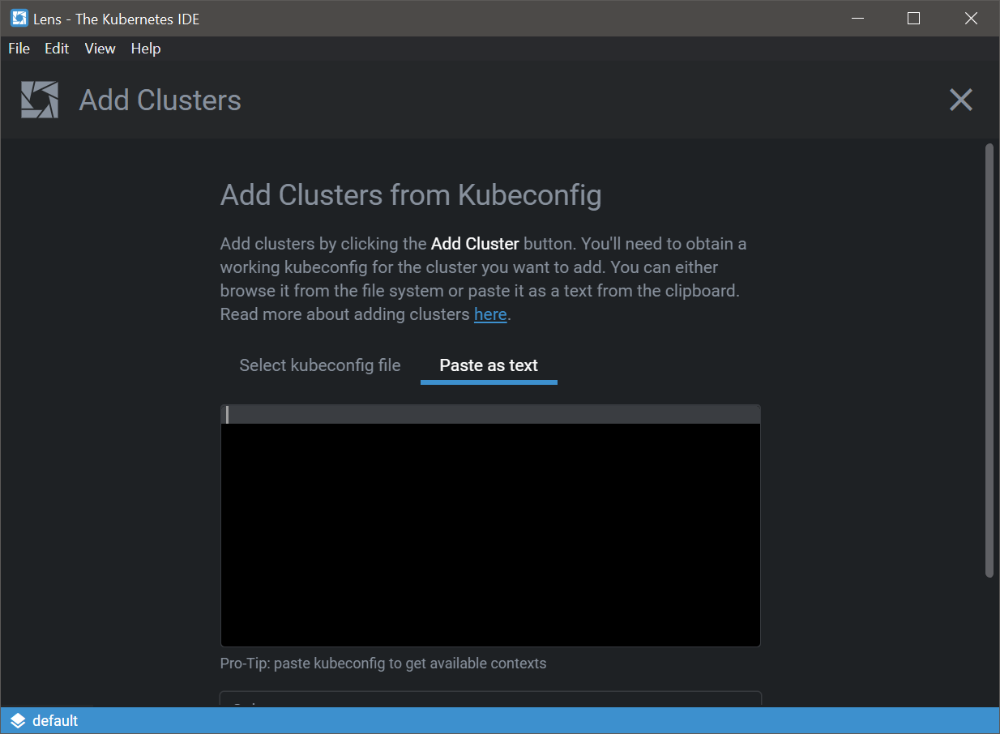
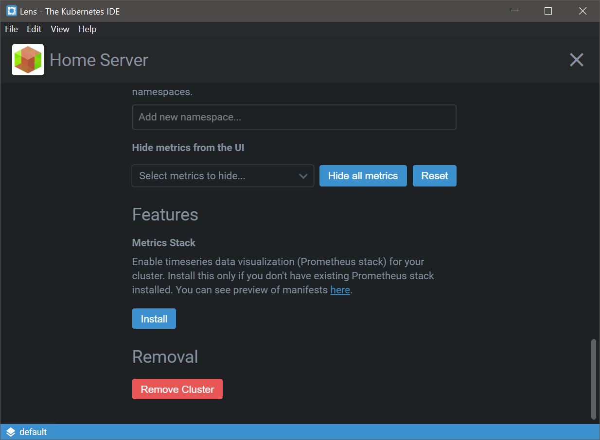
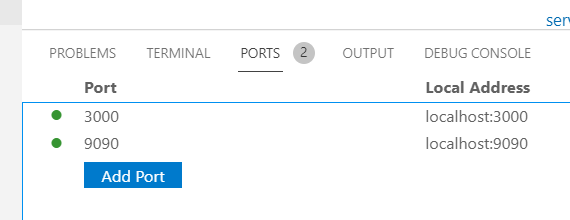
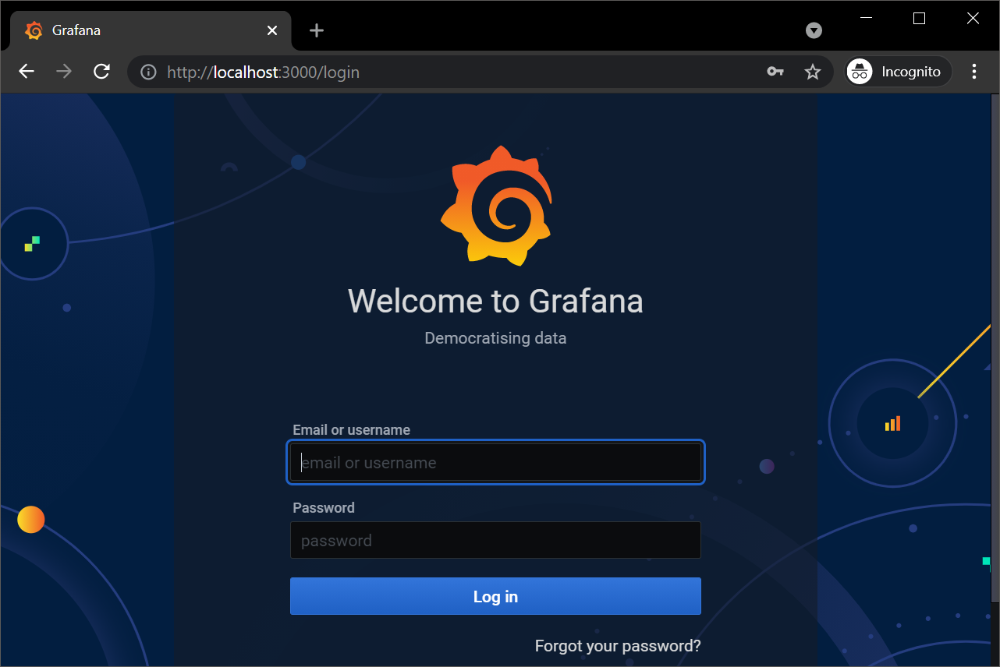
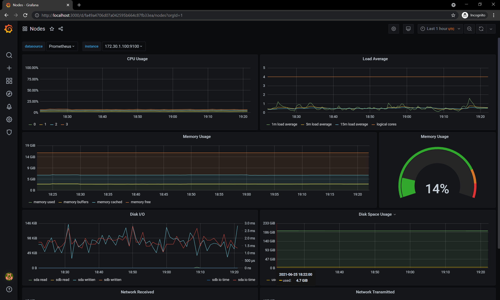
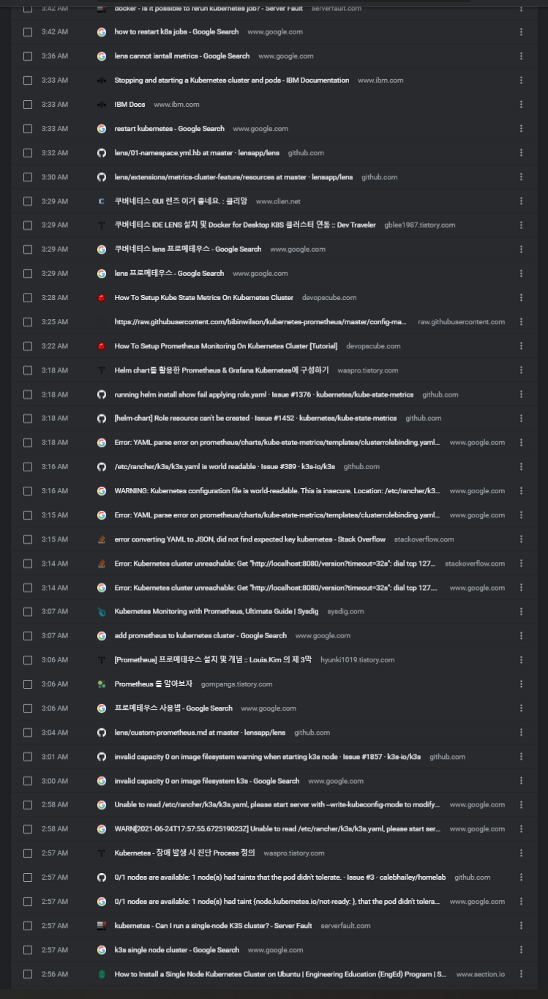

 

# K8S

Kubernetes는 여러 개의 머신 위에서 여러 개의 컨테이너들을 관리하기 위한 시스템입니다. 쿠버네티스는 여러 머신들을 하나의 클러스터로 묶어 관리하는데, 이 각각의 머신들을 노드(Node)라고 부릅니다.

이 노드을 중 일부는 클러스터 전체를 관리하는 역할을 수행하는 master node이며 일부는 단순 작업을 수행하는 worker node입니다. 모든 클러스터에는 반드시 하나의 마스터 노드가 있어야 합니다.

일반적으로는 보안상의 이유로 master node와 worker를 따로 구성하지만 저처럼 단일 머신만 가지고 있는 경우에는 한 노드가 master와 worker 역할을 동시에 수행할 수도 있습니다.

이때 master node가 정지할 경우 worker node를 제어할 수가 없기 때문에 master node가 하나인 경우에는 마스터 노드가 단일 실패 지점 (single point of failure; SPOF)이 됩니다. 그래서 고가용성 (High Availability; HA) 구성을 하는 경우에는 마스터 노드를 여러 개로 구성하기도 합니다.

아래 설명은 [쿠버네티스 공식 도큐먼트](https://kubernetes.io/ko/docs/concepts/overview/components/)를 참고했습니다.

마스터 노드에는 다음과 같은 컴포넌트들이 실행됩니다. 이들은 간단하게 컨테이너 위에서 실행되는 프로세스들이라고 봐도 무방하겠습니다.

- kube-apiserver
- etcd
- kube-scheduler
- kube-controller-manager

## kube-apiserver

API Server는 쿠버네티스의 모든 명령을 처리하는 서버입니다. 여기로 REST API 형식으로 명령이 전달되면 쿠버네티스 클러스터에 그 명령이 반영됩니다. 이 api 서버 자체도 컨테이너 위에서 실행되며, 이 api 서버 자체를 여러 개 생성해서 로드밸런싱할 수도 있습니다.

## etcd

etcd는 고가용성 key-value 저장소로 쿠버네티스의 모든 정보가 여기 저장됩니다.

## kube-scheduler

쿠버네티스에서는 컨테이너를 다룰 때 Pod이라는 단위를 사용합니다. Pod은 사실 컨테이너들의 묶음이지만 보통 Pod 하나에 컨테이너 하나만 있는 구조를 사용합니다. kube-scheduler는 이 pod을 어떤 node에 배정할지 결정해줍니다. 스케줄러가 필요한 이유는 pod을 아무 node에나 배정하면 안 되기 때문입니다. 예를 들어 GPU를 사용하는 pod의 경우 GPU가 있는 node에 배정해야 정상적으로 동작할 수 있을 것입니다. 이렇게 pod을 node에 배정할 수 있는 제약을 affinity라 하고, pod을 node에 배정할 수 없는 제약을 anti-affinity라 합니다. 스케줄러는 이뿐만 아니라 서로 밀접하게 연관된 pod들이 가까운, 혹은 같은 노드에 배정될 수 있도록 하는 등 복잡한 배치 전략을 사용합니다.

## kube-controller-manager

컨트롤러 매니저는 노드가 다운되거나 pod의 레플리카를 관리하거나, 계정에 관한 관리를 하는 등 말 그대로 여러가지 관리를 수행합니다.

컨트롤러 매니저는 논리적으로는 노드 컨트롤러, 레플리케이션 컨트롤러, 엔트포인트 컨트롤러 등 여러 프로세스로 구성되어있지만 복잡성을 낮추기 위해 바이너리 자체는 하나이며 단일 프로세스 내에서 실행됩니다.

그 외에도 AWS 등 클라우드를 사용할 때 필요한 cloud-controller-manager등이 있지만 저는 베어메탈 위에 바로 클러스터를 구성할 것이므로 넘어가겠습니다.

다음으로 워커 노드에서 작동하는 컴포넌트들을 알아보겠습니다. 워커 노드에서는 다음과 같은 컴포넌트들이 작동합니다.

- kubelet
- kube-proxy
- dns

## kubelet

kubelet은 쿠버네티스에서 pod들을 관리하는 핵심 컴포넌트입니다. master와 worker에서 둘 다 실행되며, 어떤 노드를 클러스터에 등록하는 역할을 수행하는 것이 kubelet입니다. 앞서 설명한 kube-apiserver를 컨테이너에 띄우는 역할도 수행합니다.

관리자가 API 서버에 명령을 내리면 앞서 설명했던 kube-scheduler, kube-controller-manager를 통하여 어떤 노드에 어떤 pod들이 생성되어야 하는지 혹은 삭제되어야 하는지가 결정됩니다. 그러면 마스터 노드에서 각 워커 노드로 각 워커 노드에서 실행되어야 할 pod들의 상태를 보내주는데 이를 PodSpec이라 합니다. kubelet은 이 Podspec들을 받아서 거기에 맞게 pod들을 생성하고 삭제하는 역할을 합니다.

kubelet은 직접 apiserver에 접속해서 PodSpec을 받아올 수도 있지만 파일시스템이나 HTTP endpoint를 통해 PodSpec을 받아오거나 kubelet 자체가 서버가 되어 PodSpec을 포함하는 요청을 받을 수도 있습니다.

## kube-proxy

쿠버네티스에서는 외부에 노출할 pod들을 service라는 개념으로 관리합니다. Service는 간단히 설명하자면 노드로 들어오는 트래픽을 적절히 관련된 pod으로 보내주는 proxy라 할 수 있습니다. kube-proxy는 바로 이 프록시를 실제로 구현하는 컴포넌트입니다.

## dns

마지막으로 dns는 클러스터 내부에서 동적으로 변화하는 pod들을 ip주소가 아니라 domain name을 통해 통신할 수 있도록 해주는 클러스터 내부 dns 서버입니다.

# K3S

K3S는 쿠버네티스 운영에 필요한 여러 프로세스들을 하나로 합쳐놓은 가벼운 버전의 쿠버네티스로, 임베디드나 IoT환경에 적합합니다. K3S는 K8S와 다르게 여러 컴포넌트들이 하나의 바이너리로 묶여 있으며 그래서 매우 쉽게 설치하고 실행할 수 있습니다. 그리고 클러스터 상태를 저장하는 데에 상기한 etcd 대신 sqlite가 사용됩니다. 아마 etcd가 너무 무거워서 그런 것이 아닌가 생각됩니다.

물론 저는 충분히 고성능의 머신을 사용하고 있기는 하지만 설치의 편의성과 전기요금을 감안하여 K3S를 사용하기로 결정했습니다.

> 저번 포스트에서 작성했던 `Vagrantfile`을 사용하여 가상 머신을 생성한 경우, bootstrap.sh 스크립트를 통해 자동으로 K3S가 설치됩니다.

# Lens

[Lens](https://k8slens.dev/)는 쿠버네티스 클러스터 관리를 위한 프로그램으로 공식 도큐먼트에는 Kubernetes IDE라고 되어 있습니다. 실제로 매우 편리한 여러가지 기능을 제공합니다. 대표적으로 쿠버네티스 클러스터의 상태를 알 수 있는 멋진 대시보드를 제공합니다.

> 물론 Lens같은 GUI 도구 대신 kubectl이라는 커맨드라인 도구를 통해서 클러스터를 관리할 수도 있습니다.

## kubeconfig

Lens든 kubectl이든 쿠버네티스의 apiserver에 접속하여 작업을 수행하려면 `kubeconfig` 파일이 필요합니다. `kubeconfig` 파일은 쿠버네티스 클러스터에 접속할 수 있는 인증 정보를 담고 있습니다. 물론 실제 파일 이름이 `kubeconfig`인 것은 아니며 그냥 쿠버네티스 인증을 위한 yaml파일을 그렇게 부르는 것입니다.

K3S의 경우 kubeconfig 파일은 `/etc/rancher/k3s/k3s.yaml` 경로에 있으며, 다음과 같이 생겼습니다.

```yaml
apiVersion: v1
clusters:
- cluster:
    certificate-authority-data: 보안상 생략
    server: https://127.0.0.1:6443
  name: default
contexts:
- context:
    cluster: default
    user: default
  name: default
current-context: default
kind: Config
preferences: {}
users:
- name: default
  user:
    client-certificate-data: 보안상 생략
    client-key-data: 보안상 생략
```

kubectl을 사용하는 경우에는 이 파일을 다음과 같이 커맨드라인 인자로 넘겨주면 됩니다.

```bash
kubectl --kubeconfig /etc/rancher/k3s/k3s.yaml get nodes
```

매번 이렇게 인자로 넘겨주는 것은 매우 번거로운 일이므로 다음과 같이 환경 변수로 설정해줄 수도 있습니다.

```bash
export KUBECONFIG=/etc/rancher/k3s/k3s.yaml
```

## Lens 연동하기


Lens를 실행시켜 보면 위 이미지와 같이 오른쪽 아래에 새 클러스터를 추가할 수 있는 버튼이 있습니다.



버튼을 눌러 보면 이와 같이 `kubeconfig`파일을 선택하거나 텍스트 형식으로 붙여넣을 수 있는 옵션이 있습니다. 여기서 텍스트 형식을 선택하여 `kubeconfig`파일의 내용을 붙여넣어줍니다.

그런데 위의 `kubeconfig` 파일을 보면 `server` 부분이 `127.0.0.1`로 되어 있습니다. 그러므로 이 `kubeconfig`파일을 통해서는 **오직 마스터 노드에서만 클러스터에 접속할 수 있습니다**. 우리는 Lens를 쿠버네티스 클러스터에 포함되지 않은 다른 컴퓨터에서 동작시킬 것이므로 **이 부분을 마스터 노드의 주소로 바꾸어 주어야 합니다**. 저는 로컬 네트워크상에서 접속하였으므로 저 부분을 저번 포스팅에서 설정한 바와 같이 `172.30.1.100`으로 바꿔 주었습니다.

저는 처음에 Lens를 통해 접속할 때 이 간단한 것을 몰라서 다섯 시간도 넘게 헤맸습니다. 저는 `kubeconfig`파일은 권한이 포함된 중요한 파일이니까 수정하면 안 되는 줄 알고 SSH 프록시부터 해서 갖은 시도를 다 해 봤는데 잘 안 됐었습니다...

그러면 아래와 같이 쿠버네티스 클러스터에 접속할 수 있습니다.


## Prometheus 설치

그런데 아마 이 과정을 똑같이 따라오신 분들은 위 이미지와 같은 그래프들이 표시되지 않고 대신 에러 메시지가 표시될 것입니다. 왜냐하면 저 수치들은 Prometheus라는 패키지로부터 제공되는 것인데, 아직 해당 패키지를 클러스터에 설치하지 않았으므로 수치를 받아올 수가 없기 때문입니다. 그 경우 클러스터 아이콘을 우클릭하여 설정 페이지로 들어간 후 Metrics Stack 섹션의 Install 버튼을 눌러 주면 관련 패키지들이 자동으로 설치됩니다.

> 패키지라는 표현이 올바른지 잘 모르겠습니다.



### Helm

그런데 저는 알 수 없는 이유로 이게 제대로 설치가 안 됐어서 helm을 통해 수동으로 Prometheus를 설치해줬습니다. helm 이란 npm이나 pip과 같이 패키지 및 종속성들을 자동으로 설치할 수 있도록 해 주는 관리자입니다. helm 역시 클러스터 내부에 뭔가 설치를 해야 하므로 서버와 클라이언트 구조로 되어 있습니다. 사용자가 커맨드라인에서 사용하는 클라이언트 부분을 helm이라 하며 클러스터 내에서 클라이언트로부터 요청을 받아 실제로 작업을 수행하는 부분을 tiller라 합니다. Tiller는 이미 K3S 내부에 설치되어있기 때문에 helm만 설치해주면 됩니다. 아래 설치 메뉴얼을 따라, master node에 helm을 설치해줍니다.

[https://helm.sh/docs/intro/install/](https://helm.sh/docs/intro/install/)

### Namespace

쿠버네티스는 여러 서비스들을 논리적으로 격리하기 위해 namespace라는 개념을 제공합니다. 모니터링 관련된 것들을 따로 관리하기 위해 아래와 같이 monitor namespace를 생성해줍니다.

```bash
kubectl create ns monitor
```

### Helm chart

이제 아래와 같이 helm chart를 사용하여 Prometheus 설치를 진행해줍니다. 사실 저도 helm을 오늘 처음 써 봐서, helm chart가 뭔지 아직도 잘 모르겠습니다. 아마 `package.json`처럼 뭔가 패키지랑 그 종속성들을 다 정리해놓은 거라고 생각 중입니다.

먼저 helm 리포를 추가해줍니다.

```bash
helm repo add stable https://charts.helm.sh/stable
```

그리고 Prometheus 설치를 진행합니다.

```bash
helm install stable/prometheus-operator --generate-name --set prometheusOperator.createCustomResource=false --namespace monitor
```

이후 다음 명령어를 통해 제대로 설치되었는지 확인해볼 수 있습니다.

```bash
kubectl --namespace monitor get pods -l "release=prometheus-operator-1624614050"
```

아래와 같이 뜨면 정상입니다.

```
NAME                                                            READY   STATUS    RESTARTS   AGE
prometheus-operator-162461-operator-6664cc9bd6-trfp7            2/2     Running   0          9h
prometheus-operator-1624614050-prometheus-node-exporter-bd74t   1/1     Running   0          9h
```

> 위에서 1624614050는 설치된 버전에 따라 다를 수 있습니다. 본인이 설치한 버전에 맞는 숫자로 바꿔주시면 됩니다.

마지막으로 아래와 같이 port forwarding을 추가하여 프로메테우스를 확인해볼 수 있습니다. 이는 클러스터 내부에서 외부로 포트포워딩을 해 주는 과정입니다.

```bash
kubectl port-forward  --namespace monitor $(kubectl get pod --namespace monitor --selector app=prometheus --output=jsonpath="{.items..metadata.name}") 9090
```

이때 주의할 점은 이렇게 포트포워딩을 했다 하더라도 이는 오직 마스터 노드에서 `localhost`로만 접근이 가능하고 `172.30.1.100` 과 같은 **로컬호스트가 아닌 아이피로는 접근이 불가능**하다는 점입니다. 그러므로 이렇게 클러스터 내부 → master node로 포트포워딩을 한 후 다시 이를 SSH를 통해 master node → 사용 중인 컴퓨터로 proxy하고, 이후 사용 중인 컴퓨터의 브라우저에서 localhost로 접속해야만 합니다.

VSCode를 사용하여 master node에 접근 중이라면 아래와 같이 이 과정을 쉽게 수행할 수 있습니다.



이후 브라우저를 통해 접속해보면 아래와 같이 접속이 잘 이뤄집니다.


## Lens와 Prometheus 연동

마지막으로, Lens의 설정 페이지에서 아래와 같이 Prometheus를 설정해줍니다.

아마 초기에는 installation method가 Autodetect로 되어 있고 service address가 보이지 않을 텐데 installation method를 Prometheus Operator로 설정해주면 service address를 입력할 수 있는 칸이 표시됩니다.


그러면 **Lens 연동하기** 섹션처럼 메인 화면에서 각종 metric들을 확인할 수 있습니다.

# Grafana

그리고 위 방법으로 Prometheus를 설치하면 Grafana가 따라옵니다. Grafana는 오픈 소스 데이터 분석 및 시각화 툴로 이 경우 Prometheus로부터 데이터를 받아 이쁘게 시각화해줍니다. Grafana 역시 다음과 같이 포트포워딩을 해준 후 이를 다시 로컬로 proxy해주어야 합니다.

```bash
kubectl port-forward --namespace monitor $(kubectl get pods -n monitor --selector app.kubernetes.io/name=grafana --output=jsonpath="{.items..metadata.name}") 3000
```

이후 브라우저에서 3000번으로 접근하면 아래와 같은 로그인 화면을 볼 수 있습니다.



아이디와 패스워드를 `admin`, `prom-operator`를 입력해줍니다. 그러면 이와 같이 Prometheus로부터 수집된 다양한 metric들을 시각화하여 확인할 수 있습니다.



# 참고문헌

- [http://www.dcasati.net/posts/installing-prometheus-on-kubernetes-v1.16.9/](http://www.dcasati.net/posts/installing-prometheus-on-kubernetes-v1.16.9/)
- [https://en.wikipedia.org/wiki/Grafana](https://en.wikipedia.org/wiki/Grafana)
- [https://kubernetes.io/docs/reference/command-line-tools-reference/kubelet/](https://kubernetes.io/docs/reference/command-line-tools-reference/kubelet/)
- [https://kubernetes.io/docs/concepts/overview/components/](https://kubernetes.io/docs/concepts/overview/components/)
- [https://stackoverflow.com/questions/50352621/where-is-kube-apiserver-located](https://stackoverflow.com/questions/50352621/where-is-kube-apiserver-located)
- [https://kubernetes.io/ko/docs/concepts/overview/components/](https://kubernetes.io/ko/docs/concepts/overview/components/)
- [https://rancher.com/docs/rke/latest/en/kubeconfig/](https://rancher.com/docs/rke/latest/en/kubeconfig/)
- [https://k3s.io/](https://k3s.io/)
- [https://docs.k8slens.dev/main/](https://docs.k8slens.dev/main/)
- [https://rancher.com/docs/k3s/latest/en/cluster-access/](https://rancher.com/docs/k3s/latest/en/cluster-access/)
- [https://bcho.tistory.com/1270?category=731548](https://bcho.tistory.com/1270?category=731548)
- [https://kubernetes.io/docs/tasks/extend-kubernetes/http-proxy-access-api/](https://kubernetes.io/docs/tasks/extend-kubernetes/http-proxy-access-api/)
- [https://kubernetes.io/ko/docs/tasks/access-application-cluster/access-cluster/](https://kubernetes.io/ko/docs/tasks/access-application-cluster/access-cluster)

아래는 본 포스트에 작성하지는 않았지만, Web Dashboard를 띄우기 위해 찾아 본 내용입니다.

- [https://jogeum.net/22](https://jogeum.net/22)
- [https://kubernetes.io/ko/docs/tasks/access-application-cluster/web-ui-dashboard/](https://kubernetes.io/ko/docs/tasks/access-application-cluster/web-ui-dashboard/)

# TMI

온갖 시행착오의 흔적들... 25일 새벽 2시부터 26일 새벽 4시(현재)까지 거의 450개 사이트에 방문... 여태 프로젝트들을 진행하면서 이렇게 많은 삽질을 했던 적이 없는 것 같아서 기념 삼아 남겨둡니다...


