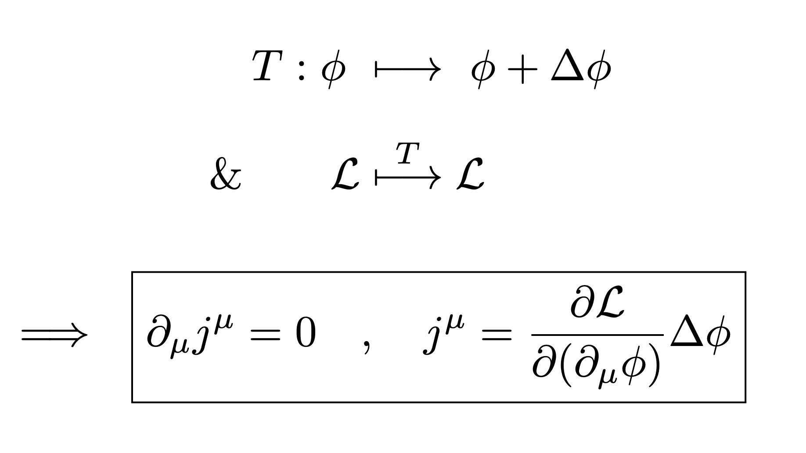

저는 옛날, 그러니까 고등학생 때부터 뇌터의 정리(Noether's Theorem)가 대체 어떻게 성립하는지가 정말 궁금했었습니다. 그런데 얼마 전 뇌터의 정리를 명쾌하게 설명해주는 영상을 찾았습니다. 그래서 그 내용을 정리해두고자 합니다.

<iframe width="560" height="315" src="https://www.youtube.com/embed/78wz4KSzUvo" title="YouTube video player" frameborder="0" allow="accelerometer; autoplay; clipboard-write; encrypted-media; gyroscope; picture-in-picture" allowfullscreen></iframe>

# 뇌터의 정리란?

먼저 뇌터의 정리에 대해 알아보겠습니다. 뇌터의 정리란, **어떠한 계에 연속적인 대칭성이 있으면, 대응되는 보존되는 물리량이 존재한다**는 정리입니다. 예컨대 공간 이동 대칭은 운동량 보존 법칙에 대응되고, 회전 대칭은 각운동량 보존 법칙에 대응됩니다.

그런데 저는 이 문장이 도무지 이해가 되지 않았습니다. 일단 연속적인 대칭성이 무엇을 의미하는지부터가 와닿지 않았습니다. 아마도 추상적인 설명은 너무 추상적이어서 이해가 잘 되지 않았고, 수식으로 구체적으로 풀어놓은 설명은 너무 수학적이어서 그 의미를 알기 어려웠기 때문이라고 생각합니다.

# 뇌터의 정리 증명

Disclaimer: 이 부분은 수학적으로 엄밀한 증명이라기보다는 어째서 위와 같은 명제가 성립하는지를 수학적으로 보인다는 느낌으로 받아들여주시기 바랍니다. 저는 수학이나 물리학 전공이 아니므로...ㅎㅎ

## 연속적인 대칭성

뇌터의 정리를 이해하려면 먼저 연속적인 대칭성이 무엇인지를 이해해야 합니다. 물론 그러려면 대칭성이 무엇인지부터 이해해야 합니다. 물리학이나 수학에서 대칭성이란 어떤 시스템에 어떤 변화를 가해도 원래와 차이가 없는 경우를 말합니다.

예컨대 거울 대칭을 고려해보겠습니다. 나비 모양을 생각해보면 좌우 반전, 즉 거울에 비친 모양을 보아도 원래 모양과 전혀 구분할 수 없습니다. 그러므로 나비 모양은 거울 대칭성을 가집니다.

그런데 나비는 좌우로 뒤집는 특정한 경우에만 동일한 모습을 얻을 수 있고, 45° 각도로 뒤집거나 위아래로 뒤집는 경우에는 동일한 모습을 얻을 수 없습니다. 그러므로 나비 모양이 가지는 거울 대칭은 연속적이지 않습니다.

마찬가지로 나비 모양을 회전시키는 경우에도 0° 회전시키거나 360° 회전시키는 특수한 경우에만 원래 모양과 같은 모양을 얻을 수 있으므로 나비 모양의 회전 대칭은 연속적이지 않습니다.

반면 원을 회전시키는 경우, 원은 어떤 각도로 회전시키더라도 같은 모양을 얻습니다. 그러므로 원의 회전 대칭은 연속적입니다.

## 연속적인 대칭성의 수학적 표현

이러한 대칭성은 수학적으로 *cyclic coordinate*라는 개념으로 나타납니다. (적어도 물리학에선 그렇습니다.)

> Cyclic coordinate란 직역하자면 '순환 좌표' 가 됩니다. 이 개념이 이런 이름을 가지는 이유는 명확하지 않습니다. 약간 검색해본 결과 이런 변수들이 보통 회전 자유도에 대응되기 때문이라고 합니다. (다른 이유라는 답변도 있었습니다.)
>
> 출처 : https://physics.stackexchange.com/questions/66640/why-are-they-called-cyclic-coordinates

이때 coordinate라 함은 해밀토니언에서의 일반화 좌표를 말하는 것입니다. 해밀토니언과 라그랑지언은 비슷한 개념이므로 라그랑지언으로 생각해도 무방할 것으로 보입니다. (일반화 좌표와 라그랑주 역학에 대해서는 이전에 [라그랑주 역학 시리즈](/posts/lagrangian-1)에서 다뤘었습니다.)

예컨대 중력 및 공기저항이 없는 무한히 넓은 공간상에서 움직이는 입자를 고려해보겠습니다. 이 입자는 운동 에너지 $\frac{mv^2}{2}$ 를 가지며 위치 에너지는 가지지 않습니다. 라그랑지언은 $L=T-V$ 로 주어지므로 이 경우 $L=T=\frac{mv^2}{2}$ 입니다. 이때 이 입자의 라그랑지언에는 입자의 위치가 등장하지 않습니다. 그러므로 입자의 위치 $x, y$는 이 시스템에 대하여 cyclic coordinate가 됩니다.

## Cyclic coordinate와 대칭성

라그랑주 역학에 따르면 시스템은 (구체적으로는 시스템의 시간에 따른 변화는) 오직 라그랑지언에 의존합니다. 그러므로 라그랑지언에 등장하지 않는 cyclic coordinate는 시스템에 어떤 영향도 줄 수 없습니다. 즉, cyclic coordinate를 변화시키더라도 시스템에는 아무런 영향이 없음을 의미하며, 따라서 cyclic coordinate는 대칭성을 의미합니다. 좀 더 구체적으로 표현하자면 "Cyclic coordinate를 변화시키더라도 시스템이 그 전과 후가 구분되지 않는다" 가 됩니다.

위의 예시에서는 좌표가 cyclic coordinate였고, 이는 공간 대칭성(평행이동 대칭성)에 해당합니다.

## 대칭성과 보존 법칙

이제 대칭성과 보존 법칙을 연결해보겠습니다. 먼저 오일러-라그랑주 방정식(Euler-Lagrange equation) 은 아래와 같습니다.

$$
\frac{\partial L}{\partial q}-\frac{d}{dt}\left(\frac{\partial L}{\partial \dot q}\right)=0
$$

이때 이 일반화 좌표 $q$ 가 cyclic coordinate라 함은 $L$ 이 $q$ 에 독립이라는 의미입니다. 그러므로 앞의 항이 0이 되고, 따라서 아래와 같은 결과를 얻습니다.

$$
\frac{d}{dt}\left(\frac{\partial L}{\partial \dot q}\right)=0
$$

이는 어떤 물리량 $\left(\frac{\partial L}{\partial \dot q}\right)$의 시간에 따른 변화 $\left(\frac{d}{dt}\right)$가 0, 즉 물리량이 불변한다는 의미이며 곧 보존법칙을 의미합니다.

> 이때 $\frac{\partial L}{\partial q}=0$ 이라 하더라도 $\frac{\partial L}{\partial \dot q}\neq 0$ 일 수 있음에 주의해야 합니다.

## 예시

간단한 시스템을 통해 보존 법칙을 하나 유도해보도록 하겠습니다.

수평 평면상에서 원점을 중심으로 하는 반지름 $r>0$ 인 원 위에 입자가 있습니다. 라그랑주 역학을 사용하기 위해 일반화 좌표 $q$를 이 입자의 위치 벡터와 $x$축이 이루는 각도라고 두도록 하겠습니다. 그럴 경우 이 입자의 속도는 $r\dot q$ 이며 따라서 운동에너지는 $\frac{mr^2\dot q^2}{2}$가 되고 수평 평면이라고 가정하였으므로 위치에너지는 상수가 됩니다. 이를 간단히 $E_p$라 두겠습니다. (위치에너지 문자에 별 의미는 없습니다. 사실 굳이 임의의 상수라 하지 않고 0으로 둬도 무방합니다.)

그러므로 일반화 좌표 $q$는 운동에너지에도 등장하지 않고 위치에너지에도 등장하지 않습니다.

> $q$와 $\dot q$ 는 라그랑주 역학에서는 서로 무관한 것으로 간주한다는 점에 주의해야 합니다.

그러므로 이 일반화 좌표, 즉 각도는 cyclic coordinate이며 따라서 이 시스템은 연속적인 회전 대칭성을 갖습니다. 그리고 이에 따라 오일러-라그랑주 방정식을 전개해보면 아래와 같이 됩니다.

$$
\frac{d}{dt}\frac{\partial \frac{mr^2\dot q^2}{2}-E_p}{\partial \dot q}
           -\frac{\partial \frac{mr^2\dot q^2}{2}-E_p}{\partial q}=0\\
\leftrightarrow \frac{d}{dt}\frac{\partial \frac{mr^2\dot q^2}{2}-E_p}{\partial \dot q}=0\\
\leftrightarrow \frac{d}{dt}\frac{\partial \frac{mr^2\dot q^2}{2}}{\partial \dot q}=0\\
\leftrightarrow \frac{d}{dt}mr^2\dot q=0\\
\leftrightarrow \frac{d}{dt}mrv=0
$$

그런데 $mrv$ 는 곧 각운동량입니다. 그러므로 위 식은 이 시스템에서 각운동량이 시간에 대해 불변임을 뜻하며, 곧 각운동량 보존법칙이 됩니다.
